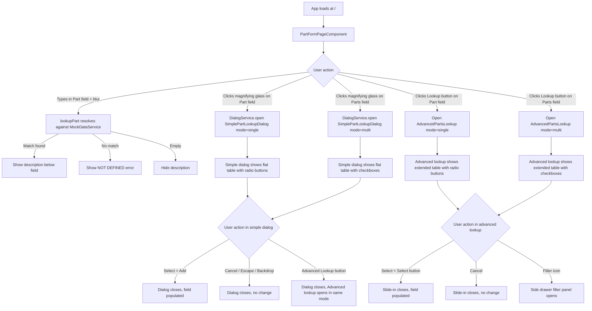

# Design Document — Part Lookup

## Overview

The Part Lookup feature adds a form page to the FE-876 harness application with two Part lookup fields: a single-select "Part" field and a multi-select "Parts" field. Each field has two lookup mechanisms:

1. **Magnifying glass icon button** → opens a Simple Part Lookup Dialog (flat table, no hierarchy)
2. **"Lookup" outlined secondary button** → opens an Advanced Parts Lookup slide-in service

The single-select Part field also supports direct text entry with type-and-tab-off validation. The form includes a standard action bar. All data is mock — no API calls are made.

The feature follows established patterns from the FE-528 reference harness: the Asset Search Dialog (simple AwDialog with TABLE) for the flat dialog, and the Add Usage panel (slide-in service) for the advanced lookup.

### Key Design Decisions

1. **Flat table, no hierarchy**: The Simple Part Lookup Dialog displays a flat list of parts — no drill-down, no breadcrumbs, no nested categories. This simplifies the dialog and matches the Figma design.
2. **Two lookup mechanisms per field**: Each field has a magnifying glass icon (simple dialog) and a "Lookup" button (advanced slide-in). The "Advanced Lookup" tertiary button in the simple dialog bridges the two.
3. **Slide-in service for advanced lookup**: The Advanced Parts Lookup uses `AwSideDrawerComponent` following the FE-528 Add Usage panel pattern, providing more filters and columns than the simple dialog.
4. **Side drawer filter panel**: Additional filters (Equipment Type, Task Type, Class Type) live in a nested side drawer filter panel, opened by a filter icon button in the quick filters row.
5. **MockDataService for centralized data**: Part data lives in a `MockDataService` rather than being hardcoded in components. The service provides both simple and extended part records.
6. **Signals over RxJS**: All reactive state uses Angular signals (`signal()`, `computed()`) consistent with the Angular 18 approach used throughout the harness.
7. **Component library first**: Every UI element uses `aw-component-lib` components.
8. **Single mode input, two components**: Both the `SimplePartLookupDialogComponent` and `AdvancedPartsLookupComponent` accept a `mode` input (`'single'` | `'multi'`) to switch between radio-button single-select and checkbox multi-select behavior.

## Architecture

### Component Tree

```
AppComponent (shell: AwNavigationMenu + AwTopNavigation)
└── <router-outlet>
    └── PartFormPageComponent (lazy-loaded at `/`)
        ├── AwBreadCrumbComponent (page breadcrumbs)
        ├── AwDividerComponent
        ├── Part field row
        │   ├── AwFormFieldComponent + AwInputDirective (Part input — single-select)
        │   ├── AwButtonIconOnlyDirective (magnifying glass → opens Simple dialog, single-select)
        │   ├── AwButtonDirective [outlined secondary] ("Lookup" → opens Advanced lookup, single-select)
        │   └── Description text (signal-driven)
        ├── Parts field row
        │   ├── AwFormFieldComponent + AwInputDirective (Parts input — multi-select)
        │   ├── AwButtonIconOnlyDirective (magnifying glass → opens Simple dialog, multi-select)
        │   ├── AwButtonDirective [outlined secondary] ("Lookup" → opens Advanced lookup, multi-select)
        │   └── Selected parts display (chips or comma-separated list)
        ├── AwActionBarComponent (Cancel / Save)
        ├── [Simple dialog opened programmatically via DialogService]
        │   └── SimplePartLookupDialogComponent (mode: 'single' | 'multi')
        │       ├── AwDialogComponent (TABLE variant)
        │       ├── AwSearchComponent (table-top slot)
        │       └── AwButtonIconOnlyDirective (barcode-scan icon, disabled placeholder)
        └── [Advanced lookup opened programmatically]
            └── AdvancedPartsLookupComponent (mode: 'single' | 'multi')
                ├── Title: "Part Search Advanced Lookup"
                ├── Quick Filters Row
                │   ├── AwSearchComponent
                │   ├── AwSelectMenuComponent (Stock Location — single-select)
                │   ├── AwSelectMenuComponent (Part — multi-select)
                │   ├── AwSelectMenuComponent (Product Category — multi-select)
                │   ├── AwToggleComponent (Include XRefs)
                │   └── AwButtonIconOnlyDirective (filter icon → opens Side Drawer)
                ├── AwTableComponent or AwDialogComponent TABLE (extended columns)
                ├── Footer: Cancel / Select
                └── AwSideDrawerComponent (filter type, opens from right)
                    ├── Title: "Filter"
                    ├── "Clear All" link
                    ├── AwSelectMenuComponent (Equipment Type — multi-select)
                    ├── AwSelectMenuComponent (Task Type — multi-select)
                    └── AwSelectMenuComponent (Class Type — multi-select)
```

### Navigation Flow



## Components and Interfaces

### New Components

| Component | Location | Purpose |
|---|---|---|
| `PartFormPageComponent` | `src/app/features/part-lookup/part-form-page.component.ts` | Main form page with Part (single-select) and Parts (multi-select) fields, breadcrumbs, action bar |
| `SimplePartLookupDialogComponent` | `src/app/features/part-lookup/simple-part-lookup-dialog.component.ts` | Flat-table part lookup dialog with search, scan button, and "Advanced Lookup" tertiary button |
| `AdvancedPartsLookupComponent` | `src/app/features/part-lookup/advanced-parts-lookup.component.ts` | Slide-in service with quick filters, extended table, and side drawer filter panel |

### Updated Files

| File | Change |
|---|---|
| `src/app/app.routes.ts` | Add default route (`/`) lazy-loading `PartFormPageComponent` |
| `src/app/services/mock-data.service.ts` | New service providing flat part data and filter dropdown data via signals |
| `MOCK-DATA-GUIDE.md` | New file documenting all mock data |

### PartFormPageComponent

**Selector**: `app-part-form-page`
**Change Detection**: `OnPush`
**Standalone**: Yes

**Injected Services**:
- `DialogService` — opens the Simple Part Lookup dialog programmatically

**Signals**:
- `partId: signal<string>('')` — current Part field value (single-select)
- `partDescription: signal<string>('')` — resolved description text for Part field
- `partDescriptionError: signal<boolean>(false)` — whether description is "NOT DEFINED"
- `selectedParts: signal<PartRecord[]>([])` — array of parts selected via multi-select dialog or advanced lookup
- `showAdvancedLookup: signal<boolean>(false)` — controls visibility of the Advanced Parts Lookup slide-in
- `advancedLookupMode: signal<'single' | 'multi'>('single')` — selection mode for the advanced lookup

**Key Methods**:
- `openSimplePartLookup(): void` — opens `SimplePartLookupDialogComponent` in single-select mode via `DialogService.open()`, handles result (including "advancedLookup" signal to bridge to advanced)
- `openSimplePartsLookup(): void` — opens `SimplePartLookupDialogComponent` in multi-select mode via `DialogService.open()`, handles result
- `openAdvancedLookup(mode: 'single' | 'multi'): void` — sets `advancedLookupMode` and `showAdvancedLookup` to open the slide-in
- `onAdvancedLookupClose(result): void` — handles result from advanced lookup, populates fields
- `onPartBlur(): void` — resolves typed value against `MockDataService` part data, updates description signals, uppercases input
- `onPartInput(event: Event): void` — clears description immediately when input is emptied
- `lookupPart(value: string): { text: string; isError: boolean }` — case-insensitive match against flat part lookup

**Template Structure**:
- `AwBreadCrumbComponent` — page-level breadcrumbs (e.g., "Home > Part Form")
- Page title (`<h4 class="aw-h-4">`)
- `AwDividerComponent`
- Form row with:
  - Part field (input + magnifying glass icon button + "Lookup" outlined button + description)
  - Parts field (input + magnifying glass icon button + "Lookup" outlined button + selected parts display)
- `AwActionBarComponent` — Cancel (left) / Save (right)
- `AdvancedPartsLookupComponent` (conditionally rendered when `showAdvancedLookup()` is true)

### SimplePartLookupDialogComponent

**Selector**: `app-simple-part-lookup-dialog`
**Extends**: `BaseDialogComponent`
**Change Detection**: `OnPush`
**Standalone**: Yes

**Inputs**:
- `mode: input<'single' | 'multi'>('single')` — controls selection behavior (radio buttons vs checkboxes)

**Injected Services**:
- `MockDataService` — provides flat part data

**Signals**:
- `tableData: signal<any[]>` — filtered flat part data
- `searchText: string` — current search query (plain field, matching FE-528 pattern)

**Column Definitions** (flat, no drill-down column):
- Selection column (checkbox/radio — handled by AwDialogComponent)
- Part (custom 2-line: ID + Description)
- Keyword (text)
- Cross-Ref (text)
- Cost (right-aligned currency "$XX.XX")

**Dialog Options**:
```typescript
dialogOptions: DialogOptions = {
  variant: DialogVariants.TABLE,
  title: 'Part Lookup',
  enableBackdropClick: true,
  enableSearch: false,
  primaryButtonLabel: 'Add',
  secondaryButtonLabel: 'Cancel',
  // Tertiary "Advanced Lookup" button handled via custom footer content or tertiaryButtonLabel
};
```

**Scan Button**:
A barcode-scan icon button is rendered next to the `AwSearchComponent` in the table-top slot. It uses `AwButtonIconOnlyDirective` with `awButtonFill` variant, styled as a blue filled button, and is set to `[disabled]="true"` as a non-functional placeholder.

```html
<button AwButtonIconOnly awButtonFill [disabled]="true" aria-label="Scan barcode">
  <aw-icon [iconName]="'barcode_scanner'"></aw-icon>
</button>
```

**Key Methods**:
- `onSearchChange(value: string): void` — filters flat part data across all visible columns (case-insensitive)
- `handleAdd(event: any): void` — in single-select mode, emits selected row via `close.emit()`; in multi-select mode, emits array of selected items
- `handleCancel(): void` — emits `null` via `close.emit()`
- `handleAdvancedLookup(): void` — emits `{ advancedLookup: true, mode: this.mode() }` via `close.emit()` to signal the parent to open the advanced lookup

### AdvancedPartsLookupComponent

**Selector**: `app-advanced-parts-lookup`
**Change Detection**: `OnPush`
**Standalone**: Yes

**Inputs**:
- `mode: input<'single' | 'multi'>('single')` — controls selection behavior

**Outputs**:
- `close: output<any>()` — emits selected part(s) or null on cancel

**Injected Services**:
- `MockDataService` — provides extended part data and filter dropdown options

**Signals**:
- `tableData: signal<any[]>` — filtered extended part data
- `searchText: signal<string>('')` — search bar value
- `stockLocation: signal<string>('')` — selected stock location
- `partFilter: signal<string[]>([])` — selected part filter values
- `categoryFilter: signal<string[]>([])` — selected product category filter values
- `includeXRefs: signal<boolean>(true)` — Include XRefs toggle state
- `showFilterDrawer: signal<boolean>(false)` — controls side drawer filter panel visibility
- `equipmentTypeFilter: signal<string[]>([])` — side drawer: equipment type selections
- `taskTypeFilter: signal<string[]>([])` — side drawer: task type selections
- `classTypeFilter: signal<string[]>([])` — side drawer: class type selections

**Column Definitions** (extended):
- Image (thumbnail placeholder — custom cell with gray box)
- Part (custom 2-line: ID + Description)
- Category (custom 2-line: Category ID + Category Description)
- On Hand (numeric)
- On Order (numeric)
- Committed (numeric)
- Request Out Pending (numeric)
- Manufacturer Part Number (text)
- Manufacturer (text)

**Quick Filters Row**:
```html
<div class="quick-filters-row">
  <aw-search [placeholder]="'Search'" [ariaLabel]="'Search parts'" ...></aw-search>
  <aw-select-menu [ariaLabel]="'Stock Location'" [enableSearch]="true" [singleSelectListItems]="stockLocationOptions()" ...>
    <aw-form-field-label>Stock Location</aw-form-field-label>
  </aw-select-menu>
  <aw-select-menu [ariaLabel]="'Part filter'" [enableSearch]="true" [multiSelectListItems]="partFilterOptions()" [enableSelectAll]="true" [placeholder]="'Filter on ID or Description'" ...>
    <aw-form-field-label>Part</aw-form-field-label>
  </aw-select-menu>
  <aw-select-menu [ariaLabel]="'Product Category'" [enableSearch]="true" [multiSelectListItems]="categoryFilterOptions()" [enableSelectAll]="true" [placeholder]="'Filter on Category'" ...>
    <aw-form-field-label>Product Category</aw-form-field-label>
  </aw-select-menu>
  <aw-toggle [ariaLabel]="'Include XRefs'" [ngModel]="includeXRefs()" (ngModelChange)="includeXRefs.set($event)"></aw-toggle>
  <span>Include XRefs</span>
  <button AwButtonIconOnly [buttonType]="'primary'" (click)="showFilterDrawer.set(true)" ariaLabel="Open filters">
    <aw-icon [iconName]="'filter_list'"></aw-icon>
  </button>
</div>
```

**Side Drawer Filter Panel**:
```html
<aw-side-drawer [drawerInformation]="filterDrawerInfo()" [openFromRight]="true">
  <div class="filter-panel">
    <div class="filter-header">
      <span class="aw-st-1-semi-bold">Filter</span>
      <a class="clear-all-link" (click)="clearAllFilters()">Clear All</a>
    </div>
    <aw-select-menu [ariaLabel]="'Equipment Type'" [enableSearch]="true" [multiSelectListItems]="equipmentTypeOptions()" [placeholder]="'Filter on Equipment Type'" ...>
      <aw-form-field-label>Equipment Type</aw-form-field-label>
    </aw-select-menu>
    <aw-select-menu [ariaLabel]="'Task Type'" [enableSearch]="true" [multiSelectListItems]="taskTypeOptions()" [placeholder]="'Filter on Task Type'" ...>
      <aw-form-field-label>Task Type</aw-form-field-label>
    </aw-select-menu>
    <aw-select-menu [ariaLabel]="'Class Type'" [enableSearch]="true" [multiSelectListItems]="classTypeOptions()" [placeholder]="'Filter on Class Type'" ...>
      <aw-form-field-label>Class Type</aw-form-field-label>
    </aw-select-menu>
  </div>
</aw-side-drawer>
```

**Empty State**: When no results match filters, display: "No results returned. Adjust quick filters and/or side filter."

**Key Methods**:
- `applyFilters(): void` — combines all quick filters and side drawer filters to produce filtered table data
- `clearAllFilters(): void` — resets all side drawer filter selections
- `handleSelect(event: any): void` — emits selected part(s) via `close` output
- `handleCancel(): void` — emits `null` via `close` output

### MockDataService

**Location**: `src/app/services/mock-data.service.ts`
**Injectable**: `providedIn: 'root'`

**Signals**:
- `simpleParts: signal<SimplePartRecord[]>` — flat list of parts for the simple dialog (partId, partDescription, keyword, crossReference, cost)
- `extendedParts: signal<ExtendedPartRecord[]>` — extended part records for the advanced lookup (adds categoryId, categoryDescription, onHand, onOrder, committed, requestOutPending, manufacturerPartNumber, manufacturer, imageUrl)
- `flatPartLookup: computed<SimplePartRecord[]>` — all parts for type-and-tab-off resolution (same as simpleParts)
- `stockLocations: signal<SingleSelectOption[]>` — stock location dropdown options
- `productCategories: signal<MultiSelectOption[]>` — product category dropdown options
- `equipmentTypes: signal<MultiSelectOption[]>` — equipment type dropdown options
- `taskTypes: signal<MultiSelectOption[]>` — task type dropdown options
- `classTypes: signal<MultiSelectOption[]>` — class type dropdown options

## Data Models

### Interfaces

```typescript
/** A part record for the simple dialog flat table. */
export interface SimplePartRecord {
  partId: string;
  partDescription: string;
  keyword: string;
  crossReference: string;
  cost: number;
}

/** An extended part record for the advanced lookup table. */
export interface ExtendedPartRecord extends SimplePartRecord {
  categoryId: string;
  categoryDescription: string;
  onHand: number;
  onOrder: number;
  committed: number;
  requestOutPending: number;
  manufacturerPartNumber: string;
  manufacturer: string;
  imageUrl: string;
}
```

### Mock Data — Simple Parts (for Simple Dialog)

| Part ID | Description | Keyword | Cross-Ref | Cost |
|---|---|---|---|---|
| PRT-OIL-001 | Oil Pump Assembly | Pump | OP-XREF-601 | $125.00 |
| PRT-OIL-002 | Oil Pan Gasket Set | Gasket | OG-XREF-602 | $22.50 |
| PRT-OIL-003 | Oil Pressure Sensor | Sensor | OS-XREF-603 | $35.75 |
| PRT-FLT-001 | Standard Oil Filter | Filter | OEM-FLT-100 | $12.50 |
| PRT-CLN-001 | Engine Coolant 1 Gal | Coolant | COOL-REF-50 | $18.75 |
| PRT-ENG-001 | Spark Plug Iridium | Ignition | SP-XREF-200 | $8.99 |
| PRT-ENG-002 | Timing Belt Kit | Belt | TB-XREF-300 | $45.00 |
| PRT-BRK-001 | Brake Fluid DOT 4 | Fluid | BF-XREF-400 | $9.50 |
| PRT-BRK-002 | Rear Brake Drum | Drum | BD-XREF-500 | $67.25 |
| PRT-FBK-001 | Front Brake Rotor | Rotor | FR-XREF-701 | $89.99 |
| PRT-FBK-002 | Front Brake Pad Set | Pad | FP-XREF-702 | $42.00 |
| PRT-FBK-003 | Front Caliper Left | Caliper | FC-XREF-703 | $155.00 |
| PRT-ELEC-001 | Alternator 12V 150A | Electrical | ALT-XREF-801 | $210.00 |
| PRT-ELEC-002 | Starter Motor Rebuilt | Starter | SM-XREF-802 | $175.50 |

### Mock Data — Extended Parts (for Advanced Lookup)

The extended records add inventory and manufacturer data to each simple part record:

| Part ID | Category ID | Category Desc | On Hand | On Order | Committed | Req Out Pending | Mfr Part # | Manufacturer |
|---|---|---|---|---|---|---|---|---|
| PRT-OIL-001 | CAT-ENG | Engine Components | 15 | 5 | 3 | 1 | MFR-OP-601 | Delphi |
| PRT-OIL-002 | CAT-ENG | Engine Components | 42 | 0 | 8 | 0 | MFR-OG-602 | Fel-Pro |
| PRT-OIL-003 | CAT-ENG | Engine Components | 8 | 10 | 2 | 0 | MFR-OS-603 | Bosch |
| PRT-FLT-001 | CAT-ENG | Engine Components | 120 | 50 | 15 | 3 | MFR-FLT-100 | Fram |
| PRT-CLN-001 | CAT-ENG | Engine Components | 65 | 20 | 10 | 2 | MFR-CLN-50 | Prestone |
| PRT-ENG-001 | CAT-ENG | Engine Components | 200 | 0 | 25 | 0 | MFR-SP-200 | NGK |
| PRT-ENG-002 | CAT-ENG | Engine Components | 18 | 12 | 4 | 1 | MFR-TB-300 | Gates |
| PRT-BRK-001 | CAT-BRK | Brake Components | 90 | 30 | 12 | 0 | MFR-BF-400 | Castrol |
| PRT-BRK-002 | CAT-BRK | Brake Components | 6 | 8 | 1 | 0 | MFR-BD-500 | ACDelco |
| PRT-FBK-001 | CAT-BRK | Brake Components | 22 | 10 | 5 | 2 | MFR-FR-701 | Brembo |
| PRT-FBK-002 | CAT-BRK | Brake Components | 35 | 15 | 7 | 1 | MFR-FP-702 | Wagner |
| PRT-FBK-003 | CAT-BRK | Brake Components | 4 | 6 | 0 | 0 | MFR-FC-703 | Cardone |
| PRT-ELEC-001 | CAT-ELEC | Electrical Components | 10 | 3 | 2 | 0 | MFR-ALT-801 | Denso |
| PRT-ELEC-002 | CAT-ELEC | Electrical Components | 7 | 5 | 1 | 0 | MFR-SM-802 | Remy |

### Mock Data — Filter Dropdowns

**Stock Locations**:
| Value | Label |
|---|---|
| LOC-MAIN | (LOC-MAIN) Main Warehouse |
| LOC-EAST | (LOC-EAST) East Bay Storage |
| LOC-WEST | (LOC-WEST) West Yard |

**Product Categories**:
| Value | Label |
|---|---|
| CAT-ENG | Engine Components |
| CAT-BRK | Brake Components |
| CAT-ELEC | Electrical Components |

**Equipment Types**:
| Value | Label |
|---|---|
| EQT-VEH | Vehicle |
| EQT-HVY | Heavy Equipment |
| EQT-GEN | Generator |

**Task Types**:
| Value | Label |
|---|---|
| TSK-REP | Repair |
| TSK-PM | Preventive Maintenance |
| TSK-INS | Inspection |

**Class Types**:
| Value | Label |
|---|---|
| CLS-A | Class A — Critical |
| CLS-B | Class B — Standard |
| CLS-C | Class C — Low Priority |


## Correctness Properties

*A property is a characteristic or behavior that should hold true across all valid executions of a system — essentially, a formal statement about what the system should do. Properties serve as the bridge between human-readable specifications and machine-verifiable correctness guarantees.*

### Property 1: Lookup resolution correctness

*For any* string input to the `lookupPart` function:
- If the trimmed input is empty, the result SHALL have empty text and `isError: false`
- If the trimmed input matches a part ID in the mock data (case-insensitive), the result SHALL have the corresponding part description as text and `isError: false`
- If the trimmed input is non-empty and does not match any part ID (case-insensitive), the result SHALL have "NOT DEFINED" as text and `isError: true`

**Validates: Requirements 10.1, 10.2, 10.3, 10.4**

### Property 2: Search filter completeness and soundness

*For any* search query string and *any* array of `SimplePartRecord` records, applying the search filter SHALL return exactly the set of rows where at least one of the five visible fields (partId, partDescription, keyword, crossReference, cost as string) contains the query as a case-insensitive substring. No matching row shall be excluded, and no non-matching row shall be included.

**Validates: Requirements 4.2, 4.3**

### Property 3: Part field display format

*For any* part with a non-empty `partId` and non-empty `partDescription`, the formatted display string SHALL equal `"(" + partId + ") " + partDescription`.

**Validates: Requirements 5.2**

### Property 4: Blur uppercases non-empty input

*For any* non-empty string value in the Part field, after the blur handler executes, the field value SHALL equal the trimmed input converted to uppercase.

**Validates: Requirements 10.5**

## Error Handling

### Dialog Dismissal

All dialog dismissal paths (Cancel button, Escape key, backdrop click) are handled uniformly:
- `BaseDialogComponent` provides `@HostListener('document:keydown.escape')` and `onBackdropClick()` — both emit `close` with no payload
- `handleCancel()` emits `close` with `null`
- The `PartFormPageComponent`'s `DialogService.open()` callback checks for a truthy result before updating state — `null`/`undefined` results are ignored, preserving existing Part field state and Parts field selections

### Advanced Lookup Dismissal

The Advanced Parts Lookup slide-in emits `null` on cancel. The `PartFormPageComponent`'s `onAdvancedLookupClose()` handler checks for a truthy result before updating state.

### "Advanced Lookup" Bridge

When the user clicks "Advanced Lookup" in the simple dialog:
1. The dialog emits `{ advancedLookup: true, mode: 'single' | 'multi' }` via `close.emit()`
2. The `PartFormPageComponent` callback detects the `advancedLookup` flag and opens the Advanced Parts Lookup in the same mode
3. No field state is modified during this transition

### Lookup Validation

The `lookupPart()` method handles three cases:
1. **Empty/whitespace input** → returns `{ text: '', isError: false }` — description is hidden
2. **Valid part ID** → returns `{ text: description, isError: false }` — description shown
3. **Invalid non-empty input** → returns `{ text: 'NOT DEFINED', isError: true }` — error shown

The `onPartInput()` handler provides immediate feedback when the field is cleared (without waiting for blur), preventing stale description text from lingering.

### Search Edge Cases

- Empty search query shows all data (no filtering applied)
- Cost values are converted to string for search matching (e.g., searching "125" matches "$125.00")

## Testing Strategy

### Unit Tests (Example-Based)

Unit tests cover specific interactions, layout verification, and integration points:

**PartFormPageComponent**:
- Renders breadcrumbs, title, divider, Part field, Parts field, and action bar (Req 1.1–1.8)
- Part field has magnifying glass icon button and "Lookup" outlined button (Req 1.5)
- Parts field has magnifying glass icon button and "Lookup" outlined button (Req 1.6)
- Clicking magnifying glass on Part field calls `DialogService.open()` with mode 'single' (Req 2.1)
- Clicking magnifying glass on Parts field calls `DialogService.open()` with mode 'multi' (Req 2.2)
- Clicking "Lookup" on Part field opens Advanced lookup with mode 'single' (Req 6.1)
- Clicking "Lookup" on Parts field opens Advanced lookup with mode 'multi' (Req 6.2)
- Single-select dialog result populates Part field with formatted string (Req 5.2, 5.3)
- Multi-select dialog result populates Parts field with selected parts display (Req 5.6, 5.7)
- Dialog cancel/null result preserves existing state for both fields (Req 5.4, 13.3)
- "Advanced Lookup" bridge: dialog emits advancedLookup flag, parent opens advanced lookup (Req 2.11)
- Clearing Part field input immediately hides description (Req 10.6)

**SimplePartLookupDialogComponent**:
- Initial state shows flat part data (Req 2.5)
- No breadcrumbs, no drill-down arrows (Req 2.5)
- Search filtering across all columns (Req 4.2, 4.3)
- Clearing search shows all data (Req 4.4)
- Dialog options configured correctly — TABLE variant, title, button labels (Req 2.3, 2.4, 2.10)
- Single-select mode shows radio buttons (Req 2.6, 14.3)
- Multi-select mode shows checkboxes (Req 2.7, 14.2)
- Scan button is rendered as disabled placeholder next to search bar (Req 2.9)
- "Advanced Lookup" button emits advancedLookup signal (Req 2.11)
- handleAdd emits selected row in single-select mode, or array in multi-select mode (Req 5.1, 5.6)
- handleCancel emits null (Req 5.4)

**AdvancedPartsLookupComponent**:
- Renders title "Part Search Advanced Lookup" (Req 6.4)
- Renders quick filters row with all filter controls (Req 7.1–7.7)
- Renders extended table columns (Req 8.1–8.9)
- Empty state message when no results (Req 8.10)
- Filter icon opens side drawer filter panel (Req 9.1)
- Side drawer contains Equipment Type, Task Type, Class Type dropdowns (Req 9.5–9.7)
- "Clear All" resets side drawer filters (Req 9.4)
- Footer has Cancel and Select buttons (Req 6.5)
- Single-select mode shows radio buttons (Req 6.6)
- Multi-select mode shows checkboxes (Req 6.7)

**MockDataService**:
- Provides flat part data with required fields (Req 11.1)
- Provides extended part data with additional fields (Req 11.2)
- Provides filter dropdown data (Req 11.3)
- flatPartLookup contains all parts (Req 11.4)

**Routing**:
- Default route loads PartFormPageComponent lazily (Req 12.1, 12.2)

### Property-Based Tests

Property tests use a PBT library (e.g., `fast-check`) to verify universal properties across generated inputs. Each test runs a minimum of 100 iterations.

| Property | Test Description | Tag |
|---|---|---|
| Property 1 | Generate random strings (empty, valid part IDs with random casing, invalid strings). Verify `lookupPart` returns correct result for each case. | Feature: part-lookup, Property 1: Lookup resolution correctness |
| Property 2 | Generate random `SimplePartRecord[]` arrays and random search query strings. Apply the filter function. Verify every returned row contains the query in at least one column (case-insensitive), and every excluded row does not. | Feature: part-lookup, Property 2: Search filter completeness and soundness |
| Property 3 | Generate random `partId` and `partDescription` strings. Verify the formatted output equals `"(" + partId + ") " + partDescription`. | Feature: part-lookup, Property 3: Part field display format |
| Property 4 | Generate random non-empty strings. Apply the blur uppercase logic. Verify the result equals `input.trim().toUpperCase()`. | Feature: part-lookup, Property 4: Blur uppercases non-empty input |

### Test Configuration

- **Framework**: Karma + Jasmine (existing project setup)
- **PBT Library**: `fast-check` (recommended for TypeScript/Angular projects)
- **Minimum iterations**: 100 per property test
- **Tag format**: `Feature: part-lookup, Property {number}: {property_text}`
